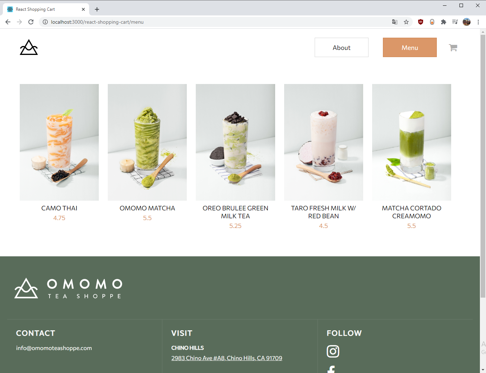
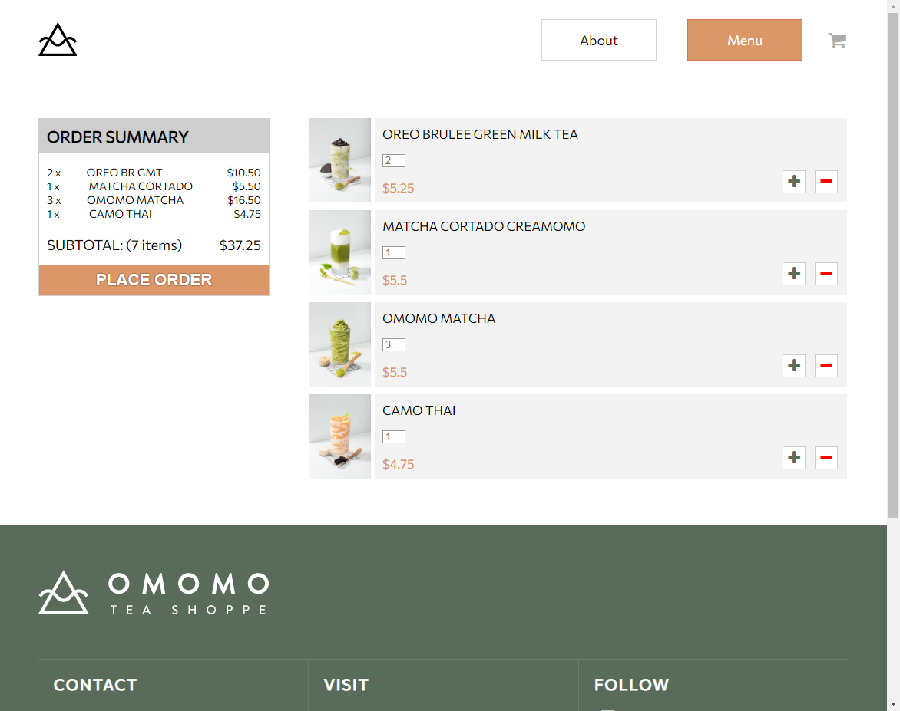

# React Shopping Cart

Check out the application [here](https://ricky-ho.github.io/react-shopping-cart/).

## Important Note

This shopping cart project was designed using [https://www.omomoteashoppe.com/](https://www.omomoteashoppe.com/) as inspiration. All of the images and major designs were replicated from their official site. All copyright goes to OMOMO Tea Shoppe. This project is only for my personal educational purposes.

## Description

This shopping cart project was created using ReactJS and create-react-app. It allows users to browse a menu of drinks, add the items to a cart, and view/remove the items from the cart. The application is also mobile responsive. 

## Future Improvements

This project was created as a front-end only project, so the data for the menu is hardcoded in and the items in the shopping cart are not stored, thus the cart will be reset on page refreshes. The cart could be implemented and stored using LocalStorage or SessionStorage so that a user's cart items will persist until the tab is closed or until their cache is cleared manually. The data for the menu items could be stored in an external database which can be retrieved as JSON via a back-end API. 

## Dependencies

- create-react-app
- react-router-dom
- font-awesome
